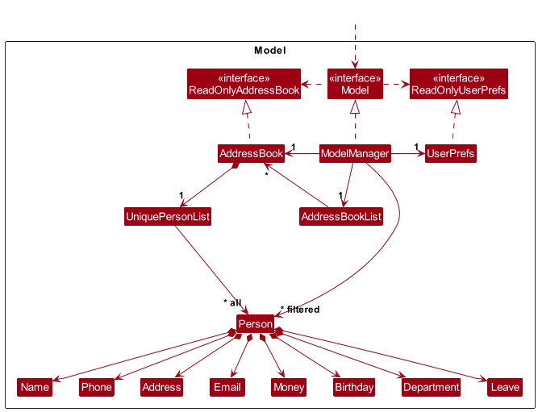
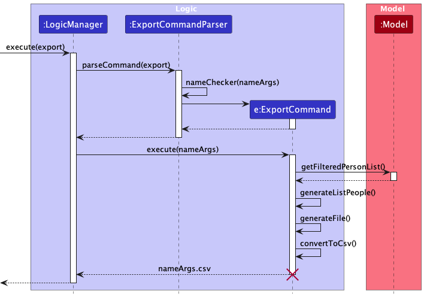
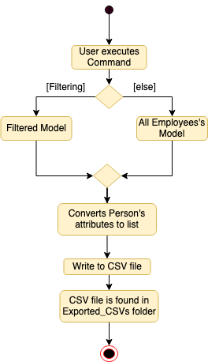
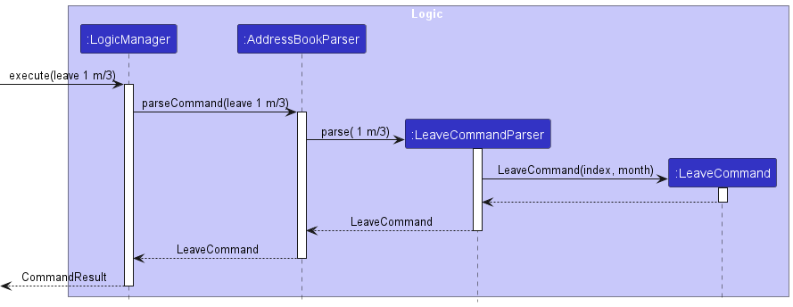
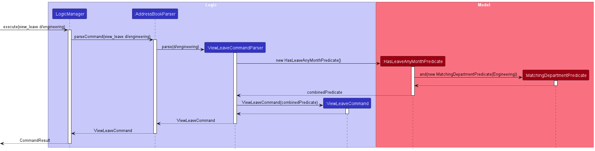
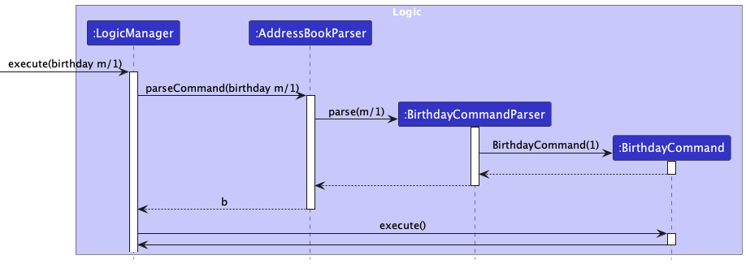
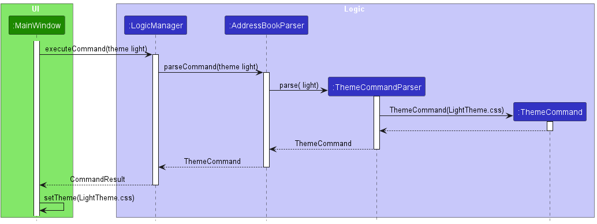

* Table of Contents
{:toc}

--------------------------------------------------------------------------------------------------------------------

## **Acknowledgements**

- This project is adapted from [AddressBook 3 (AB3)](https://github.com/se-edu/addressbook-level3)
- Libraries used: [JavaFX](https://openjfx.io/) and [JUnit5](https://github.com/junit-team/junit5)
- HR Insight logo is obtained from [Vecteezy](https://www.vecteezy.com/vector-art/4702848-abstract-letter-hr-logo-isolated-on-white-background)

--------------------------------------------------------------------------------------------------------------------

## **About this Developer Guide**

This guide aims to:
1. Provide developers with a brief overview of the design architecture of our product.
2. Explain some design considerations in the development of the application.
3. Provide interested developers with documentation to continue development of our product.

--------------------------------------------------------------------------------------------------------------------

## **Setting up, getting started**

Refer to the guide [_Setting up and getting started_](SettingUp.md).

--------------------------------------------------------------------------------------------------------------------

## **Design**

:bulb: **Tip:** The `.puml` files used to create diagrams in this document `docs/diagrams` folder. Refer to the [_PlantUML Tutorial_ at se-edu/guides](https://se-education.org/guides/tutorials/plantUml.html) to learn how to create and edit diagrams.

### Architecture

The ***Architecture Diagram*** given above explains the high-level design of the App.

Given below is a quick overview of main components and how they interact with each other.

**Main components of the architecture**

**`Main`** (consisting of classes [`Main`](https://github.com/se-edu/addressbook-level3/tree/master/src/main/java/seedu/address/Main.java) and [`MainApp`](https://github.com/se-edu/addressbook-level3/tree/master/src/main/java/seedu/address/MainApp.java)) is in charge of the app launch and shut down.
* At app launch, it initializes the other components in the correct sequence, and connects them up with each other.
* At shut down, it shuts down the other components and invokes cleanup methods where necessary.

The bulk of the app's work is done by the following four components:

* [**`UI`**](#ui-component): The UI of the App.
* [**`Logic`**](#logic-component): The command executor.
* [**`Model`**](#model-component): Holds the data of the App in memory.
* [**`Storage`**](#storage-component): Reads data from, and writes data to, the hard disk.

[**`Commons`**](#common-classes) represents a collection of classes used by multiple other components.

**How the architecture components interact with each other**

The *Sequence Diagram* below shows how the components interact with each other for the scenario where the user issues the command `delete 1`.

Each of the four main components (also shown in the diagram above),

* defines its *API* in an `interface` with the same name as the Component.
* implements its functionality using a concrete `{Component Name}Manager` class (which follows the corresponding API `interface` mentioned in the previous point.

For example, the `Logic` component defines its API in the `Logic.java` interface and implements its functionality using the `LogicManager.java` class which follows the `Logic` interface. Other components interact with a given component through its interface rather than the concrete class (reason: to prevent outside component's being coupled to the implementation of a component), as illustrated in the (partial) class diagram below.

The sections below give more details of each component.

### UI component

The **API** of this component is specified in [`Ui.java`](https://github.com/se-edu/addressbook-level3/tree/master/src/main/java/seedu/address/ui/Ui.java)

The UI consists of a `MainWindow` that is made up of parts e.g.`CommandBox`, `ResultDisplay`, `PersonListPanel`, `StatusBarFooter` etc. All these, including the `MainWindow`, inherit from the abstract `UiPart` class which captures the commonalities between classes that represent parts of the visible GUI.

The `UI` component uses the JavaFx UI framework. The layout of these UI parts are defined in matching `.fxml` files that are in the `src/main/resources/view` folder. For example, the layout of the [`MainWindow`](https://github.com/se-edu/addressbook-level3/tree/master/src/main/java/seedu/address/ui/MainWindow.java) is specified in [`MainWindow.fxml`](https://github.com/se-edu/addressbook-level3/tree/master/src/main/resources/view/MainWindow.fxml)

The `UI` component,

* executes user commands using the `Logic` component.
* listens for changes to `Model` data so that the UI can be updated with the modified data.
* keeps a reference to the `Logic` component, because the `UI` relies on the `Logic` to execute commands.
* depends on some classes in the `Model` component, as it displays `Person` object residing in the `Model`.

### Logic component

**API** : [`Logic.java`](https://github.com/se-edu/addressbook-level3/tree/master/src/main/java/seedu/address/logic/Logic.java)

Here's a (partial) class diagram of the `Logic` component:

The sequence diagram below illustrates the interactions within the `Logic` component, taking `execute("delete 1")` API call as an example.

:information_source: **Note:** The lifeline for `DeleteCommandParser` should end at the destroy marker (X) but due to a limitation of PlantUML, the lifeline reaches the end of diagram.

How the `Logic` component works:

1. When `Logic` is called upon to execute a command, it is passed to an `AddressBookParser` object which in turn creates a parser that matches the command (e.g., `DeleteCommandParser`) and uses it to parse the command.
1. This results in a `Command` object (more precisely, an object of one of its subclasses e.g., `DeleteCommand`) which is executed by the `LogicManager`.
1. The command can communicate with the `Model` when it is executed (e.g. to delete a person).
1. The result of the command execution is encapsulated as a `CommandResult` object which is returned back from `Logic`.

Here are the other classes in `Logic` (omitted from the class diagram above) that are used for parsing a user command:

How the parsing works:
* When called upon to parse a user command, the `AddressBookParser` class creates an `XYZCommandParser` (`XYZ` is a placeholder for the specific command name e.g., `AddCommandParser`) which uses the other classes shown above to parse the user command and create a `XYZCommand` object (e.g., `AddCommand`) which the `AddressBookParser` returns back as a `Command` object.
* All `XYZCommandParser` classes (e.g., `AddCommandParser`, `DeleteCommandParser`, ...) inherit from the `Parser` interface so that they can be treated similarly where possible e.g, during testing.

### Model component
**API** : [`Model.java`](https://github.com/se-edu/addressbook-level3/tree/master/src/main/java/seedu/address/model/Model.java)

The `Model` component,

* stores the address book data i.e., all `Person` objects (which are contained in a `UniquePersonList` object).
* stores the currently 'selected' `Person` objects (e.g., results of a search query) as a separate _filtered_ list which is exposed to outsiders as an unmodifiable `ObservableList<Person>` that can be 'observed' e.g. the UI can be bound to this list so that the UI automatically updates when the data in the list change.
* stores a `UserPref` object that represents the user’s preferences. This is exposed to the outside as a `ReadOnlyUserPref` objects.
* does not depend on any of the other three components (as the `Model` represents data entities of the domain, they should make sense on their own without depending on other components)

:information_source: **Note:** An alternative (arguably, a more OOP) model is given below. It has a `Tag` list in the `AddressBook`, which `Person` references. This allows `AddressBook` to only require one `Tag` object per unique tag, instead of each `Person` needing their own `Tag` objects. 

### Storage component

**API** : [`Storage.java`](https://github.com/se-edu/addressbook-level3/tree/master/src/main/java/seedu/address/storage/Storage.java)

The `Storage` component,
* can save both address book data and user preference data in JSON format, and read them back into corresponding objects.
* inherits from both `AddressBookStorage` and `UserPrefStorage`, which means it can be treated as either one (if only the functionality of only one is needed).
* depends on some classes in the `Model` component (because the `Storage` component's job is to save/retrieve objects that belong to the `Model`)

### Common classes

Classes used by multiple components are in the `seedu.addressbook.commons` package.

--------------------------------------------------------------------------------------------------------------------

## **Implementation**

This section describes some noteworthy details on how certain features are implemented.

### Undo/redo feature

#### Implementation

The implementation involves creating an `AddressBookList` class which extends from `ArrayList<AddressBook>` to store the history of `AddressBook`.
`AddressBookList` also stores an integer `index` as a pointer to the current `AddressBook` and an `ArrayList<String>` of commands input by the user called `pastCommands`.

Whenever `AddressBook` is changed, it will store its copy and append it to the `AddressBookList`, increment `index` by 1, and append the command
which modifies the `AddressBook` to `pastCommands`.

When `AddressBookList#undo()` is called, the current `AddressBook` changes to `AddressBookList.get(index - 1)` and `index` is decremented by 1.
If the current `index` is at 0, `AddressBookList` will throw an error stating there is no command to undo.

If after undoing some command the user decides to modify the `AddressBook` with new commands, `AddressBookList` will overwrite all `AddressBook` after that particular state.
For example, currently `AddressBookList` has 10 `AddressBook` in it and the current state is at `AddressBookList.get(5)`. Then, the user adds an employee. All `AddressBook` 
at index 6 to 9 will be deleted and `AddressBookList.get(6)` will now contain the new `AddressBook` that has the new employee in it.

When `AddressBookList#redo()` is called, the current `AddressBook` changes to `AddressBookList.get(index + 1)` and `index` is incremented by 1.
If the current `index` is at `AddressBookList.size() - 1`, `AddressBookList` will throw an error stating there is no command to redo.

`AddressBookList` sits in `ModelManager` class where it will be modifed whenever `ModelManager#addPerson()`, `ModelManager#deletePerson()`, and `ModelManager#setPerson()`
are called, i.e., whenever `AddressBook` is changed. `ModelManager#undo()` will call `AddressBookList#undo()` and `ModelManager#redo()` will call `AddressBookList#redo()`.

#### Design Considerations

**Aspect: How Undo/Redo executes:**

* **Alternative 1 (current choice):** Stores the entire address book.
  * Pros: Easy to implement.
  * Cons: May have performance issues in terms of memory usage.

* **Alternative 2:** Stores only the changes between address book versions. For example, only store the employee being added when the user adds an employee.
  * Pros: Less memory.
  * Cons: More complications on the logic side: undoing `add` = `delete`, undoing `clear` = `add` back all employees, etc.

### Export Data Feature

#### Implementation

The proposed export mechanism is facilitated by `AddressBook`. Additionally, the operation is exposed in the Model interface which allows users to perform `filter` operation to discard selected portions of the Model interface before exporting.

The primary operations that aid in this mechanism are:
* `getFilteredPersonList()` -- Used in conjunction with `filter` operation so that the model will display the latest Persons of interest.
* `generateListPeople()` -- Performs extracting of Person objects from the latest model and obtaining the Person's attributes.
* `generateFile()` -- Creates a directory for exported CSVs and a File object containing the filename imposed by the user.
* `convertToCsv()`-- Performs writing of Person's attributes into the created File Object in `generateFile()`.

Given below is an example usage scenario and how the export mechanism behaves at each step.

Step 1. The user launches the application for the first time. The initial address book state will display all the employees.

Step 2. The user executes `list d/Engineering` command which filters employees belonging to the Engineering department. This command also executes `getFilteredPersonList()` that alters the Model by containing only the filtered Person list.

Step 3. The user executes `export engineering_dept` command which takes the "altered" Model containing filtered Person objects and executes `generateListPeople()` which helps to obtain Person Objects from the currentModel and extracting their attributes into a List.

Step 4. After completion of step 3 and still in the `export engineering_dept` command, `generateFile()` and `convertToCsv()` are called sequentially to allow writing of Person' attributes into the exported CSV file.

The following sequence diagram shows how the export operation works:

The following activity diagram summarizes what happens when a user attempts to export the current employees' data:

#### Design Considerations

**Aspect: How exports executes:**

* **Alternative 1 (current choice):** User specifies filename and file is stored in fixed location.
    * Pros: Easy to implement. Easy for user to find his newly exported file.
    * Cons: Doesn't provide user a view on whether the filename has already been used. Loss of file is a concern.

* **Alternative 2:** Full flexibility for user to select the exported location of one's files.
    * Pros: User can perform better categorisation of data according to organisation's needs.
    * Cons: Harder to implement since program needs to know which locations are out-of-bounds. Example: src files.

### Leave Feature

#### Implementation

This feature adds a way to record and view registered leaves for the employees.
This is implemented by adding a `Leave` class as an attribute to `Person` class.
Manipulating the leave records can be done using `Command#LeaveCommand` and viewing can be done using `Commmand#ViewLeaveCommand`.
ViewLeaveCommand can be invoked with or without parameter.

Given below is an example usage scenario and how the birthday mechanism behaves at each step.

Step 1: The user launches the application for the first time.

Step 2: The user executes `view_leave` to see the currently registered leaves of the employees.
This function works like a filter through the `model`. This is done by having a predicate to test if the person has a leave.
For the default no parameter `view_leave` function, this will invoke a creation of `HasLeaveAnyMonthPredicate` predicate, which tests if the employees has leave in any of the months. The command goes through the `ViewLeaveCommandParser` class to check if there is any parameters.
This command will return a list of employees who has leave in any of the months by invoking a `model.updateFilteredPersonsList(predicate)`.

Step 3: The user adds and removes leaves to employees by doing a `leave 2 m/1,-2`
This command will go through the `LeaveCommandParser` class. The parser will then extract the relevant information like the employee's index and the months to add/remove. This command adds a leave in January and removes a leave in February for the employee on index 2.

Step 4: The user wants to see the employees with leaves in January or February in the Engineering department by doing a `view_leave m/1,2 d/engineering`
This works similarly to the default `view_leave` but with parameters. The `ViewLeaveCommandParser` will parse the command and will combine the predicates as it parses the arguments.
In this case, the `ViewLeaveCommandParser` will create `HasLeaveThisMonthPredicate` and `MatchingDepartmentPredicate`.
For every month specified, the parser will create a `HasLeaveThisMonthPredicate` and do an `or()` operation of the predicate, resulting in a `combinedPredicate` variable. The parser will also create a `MatchingDepartmentPredicate` and do an `and()` to the combinedPredicate().
This `combinedPredicate` will then be passed to the `ViewLeaveCommand` constructor, which will create a `ViewLeaveCommand` that filters the `model` using the `combinedPredicate` specified. 

The sequence diagram below shows how the `leave` commands execute:

The sequence diagram below shows how the `view_leave` commands execute:

#### Design Considerations

**Aspect: How Leave executes:**

* **Alternative 1 (current choice):** User can add and remove leaves at the same time for one employee.
    * Pros: User can add and remove multiple leaves faster than doing it one by one.
    * Cons: Might be confusing to the user at first, the expected format needs to be properly explained.

* **Alternative 2:** Only allows one addition/removal at a time.
    * Pros: Straightforward and intuitive for the users to understand.
    * Cons: Takes longer for the user to add or remove multiple leaves for the same employee.

**Aspect: How View Leave executes:**

* **Alternative 1 (current choice):** User can view leaves for multiple months at once.
    * Pros: The user can view all the employees with leaves in any of the specified months at once when the use case allows.
    * Cons: Might be confusing to the user at first, the expected format needs to be properly explained. For example, it might be confusing whether the relationship of the months is an "and" or an "or". In this implementation, it is an "or", meaning it will show employees having leave(s) in any of the months instead of all of the months.

* **Alternative 2:** Only allows users to view one leave month at a time.
    * Pros: Straightforward and intuitive for the users to understand.
    * Cons: There might be use cases where the user needs to compare and see different months at once.

### Birthday Feature

#### Implementation

The birthday feature extends HR Insight by allowing the user to view birthdays in a given month.
This operation is exposed in the Command Interface as `Command#BirthdayCommand`.

Given below is an example usage scenario and how the birthday mechanism behaves at each step.

Step 1: The user launches the application for the first time.

Step 2: The user executes `add n/John Doe ... ` to add a new employee.

Step 3: After adding a few employees into the application, he/she wants to view the birthdays in the month of January
to prepare the birthday celebrations in advance. The `birthday m/1` command will display all employees with birthdays
in the month of January.

Step 4: The user then realises that today is the first day of a new month and he/she wants to view which employees
have birthdays in the current month. The `birthday` command without providing the month will display all employees with
birthdays in the current month.

The following sequence diagram shows how the `birthday` command works:

#### Design Considerations
The birthday command is designed to show users birthday by month instead of week/day as month gives the user a broader
range to work with. Furthermore, it is also a common practice for companies to have 1 celebration for all employees'
birthdays in a month rather than having multiple individual celebrations. Hence, this feature is designed to show
birthdays by month.

**Aspect: How Birthday executes:**

* **Alternative 1 (current choice)** : Allows the user to view birthday in a month
    * Pros: Allows the user to view birthdays in a broader range.
    * Cons: User cannot view birthdays that occur across multiple months
* **Alternative 2**: Allows the user to view birthdays in multiple months
    * Pros: User will be able to view birthdays across multiple months with only one use of the command. 
      (e.g. `birthday m/2,3` returns all birthdays in February and March )
    * Cons: We must ensure that every month given by the user is valid and mention which months have no birthdays.
 

### Change Theme Feature

#### Implementation

This feature adds a way to change the theme of the application.
The default theme is the dark theme, and it can be changed at any point of usage by using the command `theme`.
This is implemented by adding a `Command#ThemeCommand` to take the user input of changing themes. 
The actual changing of the theme itself is done by changing the stylesheet of the `MainWindow`.
`MainWindow` keeps track of the current stylesheet and when it receives a theme change request, it will remove the current stylesheet and add the new stylesheet using the `setTheme()` function.

Given below is an example usage scenario and how the birthday mechanism behaves at each step.

Step 1: The user launches the application for the first time.

Step 2: The user executes `theme` wishing to see the available themes.
This command will return feedback that the theme is invalid, as there are no arguments detected. It will then show the names of the valid themes currently implemented. At the point of time of writing this developer guide, the available themes are `light`, `dark`, `red`, `green` and `blue`.

Step 3: The user changes the theme by calling `theme red`.
This command will pass through the `ThemeCommandParser` class that will parse the arguments given (`red` in this case). The parse class will then return a `ThemeCommand` containing the name of the stylesheet for the given theme. This will continue to get passed on to `MainWindow` through `CommandResult`. `MainWindow` will then execute the `setTheme()` function, which removes the current stylesheet and adds the new stylesheet to the `MainWindow.fxml` file.

The sequence diagram below shows how the `theme` commands execute:

#### Design Considerations

**Aspect: How Theme executes:**

* **Alternative 1 (current choice):** Users can specify the theme they want to use.
    * Pros: Users can have choices of themes they can use.
    * Cons: More tedious to implement with a need for parsing user commands and translating them to stylesheets.

* **Alternative 2:** Users can only switch between dark and light themes.
    * Pros: Easier to implement, no need for arguments for the command.
    * Cons: Limiting users' choices, the function will be harder to extend in the future.

--------------------------------------------------------------------------------------------------------------------

## **Documentation, logging, testing, configuration, dev-ops**

* [Documentation guide](Documentation.md)
* [Testing guide](Testing.md)
* [Logging guide](Logging.md)
* [Configuration guide](Configuration.md)
* [DevOps guide](DevOps.md)

--------------------------------------------------------------------------------------------------------------------

## **Appendix A: Requirements**

### Product scope

**Target user profile**:

* for HR people to manage employee data in the company, including employees' claims and leaves
* prefer desktop apps over other types
* can type fast
* prefers typing to mouse interactions
* is reasonably comfortable using CLI apps

**Value proposition**: Provide a platform for Startup HR workers without a solid employee data management system.

### User stories

Priorities: High (must have) - `* * *`, Medium (nice to have) - `* *`, Low (unlikely to have) - `*`

| Priority | As a …​                                    | I want to …​                     | So that I can…​                                                        |
| -------- | ------------------------------------------ | ------------------------------ | ---------------------------------------------------------------------- |
| `* * *`  | HR employee                                  | add all employee's information       | manage all employee's information.                |
| `* * *`  | HR employee                                  | update an employee's information       | have the latest information on the employee.                |
| `* * *`  | HR employee                                  | delete an employee's information       | do not waste storage on retired/resigned employees.               |
| `* * *`  | HR employee                                  | list all my employees    | can keep track of the company/department's headcount.          |
| `* * *`  | HR employee                                      | process employee's outstanding claims            | can either subtract or add to an employee's entitlement fund.                                                                        |
| `* * *`  | HR employee                                      | have an overview on the annual leave of each employee         | can identify which employee needs to start clearing their annual leave days.                                                                        |
| `* * *`  | HR employee                                      | add an employee's planned leave dates         | keep track of the months that have the lowest manpower.                                                                        |
| `* * *`  | HR employee                                      | view all employees who have birthdays in a given month         | can plan the celebrations beforehand.                                                                        |
| `* *`  | HR employee                                       | find an employee by name          | locate details of an employee without having to go through the entire list |
| `* *`    | user                                       | hide private contact details   | minimize chance of someone else seeing them by accident                |
| `*`      | user with many persons in the address book | sort persons by name           | locate a person easily                                                 |
| `*`      | user with color preferences                | change the application's theme          | like the user interface more                                    |

*{More to be added}*

### Use cases

(For all use cases below, the **System** is the `HR Insight` and the **Actor** is the `user / HR people`, unless specified otherwise)

**Use case: Add an Employee**

**MSS**

1.  User requests to add an employee with specified information.
2.  HR Insight adds an employee with the given information.
3.  HR Insight indicates that the new employee has been added.
4.  HR Insight shows a list of employees including the new employee.

    Use case ends.

**Extensions**

* 2a. At least one of the required information is empty or invalid.

    * 2a1. HR Insight shows an error message.

      Use case ends.

* 3a. The employee already exists.

    * 3a1. HR Insight indicates that the employee already exists.

      Use case ends.

**Use case: Edit an Employee**

**MSS**

1.  User requests to list employees.
2.  HR Insight shows a list of employees.
3.  User requests to edit an employee in the list specified by its index, with the employee's new information.
4.  HR Insight edits the employee.
5.  HR Insight indicates that the employee has been edited.
6.  HR Insight shows a list of employees, with the employee's information now edited.

    Use case ends.

**Extensions**

* 2a. The list is empty.

  Use case ends.

* 3a. The given index is invalid.

    * 3a1. HR Insight shows an error message.

      Use case resumes from step 2.

* 3b. User does not specify any new information for the employee.

    * 3b1. HR Insight shows an error message that at least one field to edit must be provided.

      Use case resumes from step 2.

* 3c. At least one of the field given by the user is empty or invalid.

    * 3c1. HR Insight shows an error message.

      Use case resumes from step 2.

**Use case: Delete an Employee**

**MSS**

1.  User requests to list employees.
2.  HR Insight shows a list of employees.
3.  User requests to delete an employee in the list specified by its index.
4.  HR Insight deletes the employee.
5.  HR Insight indicates that the employee has been deleted.
6.  HR Insight shows a list of employees excluding the deleted employee.

    Use case ends.

**Extensions**

* 2a. The list is empty.

  Use case ends.

* 3a. The given index is invalid.

    * 3a1. HR Insight shows an error message.

      Use case resumes from step 2.

**Use case: List Employees**

**MSS**

1.  User requests to list all employees.
2.  HR Insight shows all employees of an organisation.
3.  User requests to filter employees by a specified department.
4.  HR Insight shows all employees of the specified department.

    Use case ends.

**Extensions**

* 2a. The employee's list is empty.

  Use case ends.

* 3a. The given department is invalid.

    * 3a1. HR Insight shows an error message.

      Use case resumes from step 3.

**Use case: Managing Employee's Claim**

**MSS**

1.  User requests to list all employees.
2.  HR Insight shows a list of employees.
3.  User requests to allocate or deduct an amount from the employee's claim budget by specifying the employee's index.
4.  HR Insight displays the updated claim of the specified employee.

    Use case ends.

**Extensions**

* 3a. User didn't provide an index and/or claim amount.

    * 3a1. HR Insight shows an error message.

  Use case ends.

* 3b. User provides a wrong index (Either negative or more than current headcount).

    * 3b1. HR Insight shows an error message.

  Use case ends.

* 3c. User didn't provide +/- when stating the claim amount.

    * 3c1. HR Insight shows an error message.

  Use case ends.

* 3d. User provides a claim amount that is greater than the employee's current entitlement fund balance (Only Applicable for -).

    * 3d1. HR Insight shows an error message.

  Use case ends.

**Use case: Adding Employee's Leaves**

**MSS**

1.  User requests to list all employees.
2.  HR Insight shows a list of employees.
3.  User requests to add a leave of a specified month for an employee.
4.  HR Insight records the leave of the employee.

    Use case ends.

**Extensions**

* 3a. User provides a wrong index (Either negative or more than current headcount).

    * 3a1. HR Insight shows an error message.

  Use case ends.

* 3b. User provides a wrong month (Either negative or more than 12).

    * 3b1. HR Insight shows an error message.

  Use case ends.

**Use Case: Viewing Employees' Leaves**

**MSS**

1. User requests to view the leave dates of all employees.
2. HR Insight shows the leave dates of all employees.

   Use case ends.

**Extensions**
* 1a. User provides the index of a specific employee.
    * 1a1. HR Insight shows the leave dates of the specified employee.

  Use case ends.

* 1b. User provides a specific month.
    * 1b1. HR Insight shows the leave dates of all employees occurring in the specified month.

  Use case ends

* 1c. User provides a specific department.
    * 1c1. HR Insight shows the leave dates of all employees in the specified department.

  Use case ends.

* 1d. User provides an invalid index/month/department.
    * 1d1. HR Insight shows an error message.

  Use case ends.

**Use Case: Resetting Employees' Leaves**

**MSS**

1. User hopes to reset all employees to have no recorded leaves.
2. HR Insight will show "-" under the leave attribute for each employee.

    Use case ends.

**Use Case: Viewing Employees' Birthdays**

**MSS**

1. User requests to view the birthdays of all employees.
2. HR Insight shows the birthdays of all employees.

   Use case ends.

**Extensions**
* 1a. User provides a specific month.
    * 1a1. HR Insight shows all birthdays in the specified month.

  Use case ends.

* 1b. User provides an invalid month.
    * 1b1. HR Insight shows an error message.

  Use case ends.

**Use Case: Viewing Employee(s)' Attribute**

**MSS**

1. User requests to view specific attribute of employee(s).
2. HR Insight shows the specific attribute of the employee(s).

   Use case ends.

**Extensions**
* 1a. User provides a false attribute parameter (AKA wrong prefix).
    * 1a1. HR Insight shows an error message.
    * 1a2. HR Insight shows all the attributes (Prefixes) it can display for employee(s).

  Use case ends.

* 1b. User didn't provide any attribute that one wants to view.
    * 1b1. HR Insight shows an error message.
    * 1b2. HR Insights shows all the attributes (Prefixes) it can display for employee(s).

  Use case ends.

* 1c. User provides more than 1 prefix/attribute that one wants to view.
    * 1c1. HR Insight shows an error message informing user of the one attribute limit.
    * 1c2. HR Insights shows all the attributes (Prefixes) it can display for employee(s).

  Use case ends.

**Use Case: Exporting Employee(s)' data**

**MSS**

1. User requests to download Employee(s)' data into CSV format.
2. User provides the filename in which the data will be stored as.
3. HR Insight will download the file into Exported_CSVs folder.

   Use case ends.

**Extensions**
* 2a. User didn't provide any filename to store all the data.
    * 2a1. HR Insight shows an error message requesting user to indicate a filename.

  Use case ends.

* 2b. User provide excess filenames (> 1) to store the data.
    * 2b1. HR Insight shows an error message requesting user to specify only one filename.

  Use case ends.

**Use Case: Changing Application's Theme**

**MSS**

1. User requests to change the current theme.
2. The application theme changes.

   Use case ends.

**Extensions**
* 1a. User didn't provide any theme names.
    * 1a1. HR Insight shows an error message alerting user of invalid theme name and giving a list of valid theme names.

  Use case ends.

* 1b. User provide invalid theme name.
    * 1b1. HR Insight shows an error message alerting user of invalid theme name and giving a list of valid theme names.

  Use case ends.

### Non-Functional Requirements

1.  Should work on any _mainstream OS_ as long as it has Java `11` or above installed.
2.  Should be able to hold up to 1000 persons without a noticeable sluggishness in performance for typical usage.
3.  HR people with above average typing speed for regular English text (i.e. not code, not system admin commands) should be able to accomplish most of the tasks faster using commands than using the mouse.
4.  Should respond quickly to user input with minimal latency.
5.  Should not crash under normal usage conditions.
6.  Should have mechanisms to recover gracefully from unexpected errors or crashes.
7.  Should have comprehensive user guide and documentation for developers.

### Glossary

* **Mainstream OS**: Windows, Linux, Unix, OS-X
* **Private contact detail**: A contact detail that is not meant to be shared with others

--------------------------------------------------------------------------------------------------------------------

## **Appendix B: Instructions for manual testing**

Given below are instructions to test the app manually.
Prerequisites: List all employees using the list command. The list is non-empty.

:information_source: **Note:** These instructions only provide a starting point for testers to work on;
testers are expected to do more *exploratory* testing.

### Launch and shutdown

1. Initial launch

   1. Download the jar file and copy into an empty folder
   2. Double-click the jar file Expected: Shows the GUI with a set of sample contacts. The window size may not be optimum.

2. Saving window preferences 

   1. Resize the window to an optimum size. Move the window to a different location. Close the window.
   2. Re-launch the app by double-clicking the jar file. 
   Expected: The most recent window size and location is retained.

### Adding an employee

1. Positive Test case: `add n/Adam p/12345678 e/adam@gmail.com a/Singapore s/10000 b/5000 d/Engineering dob/2000-01-01` 
   Expected: An employee added with name `adam`, phone `12345678`, email `adam@gmail.com`, address `Singapore`, salary `10000`, claim budget: `5000`, department: `Engineering` and DOB being `1 Jan 2000`.

2. Negative Test case: `add n/Adam` 
   Expected: Error message since other attributes like `phone`, `email`, `address`, `salary`, `claim_budget`, `department` and `DOB` are not provided.

### Listing an employee

1. Positive Test Case: `list` 
   Expected: Listed all employees (7)

2. Positive Test Case: `list d/Engineering` 
   Expected: Listed filtered employees (3)

### Deleting an employee

1. Positive Test Case: `delete 1` 
   Expected: First employee is deleted from the list.

2. Negative Test Case: `delete` 
   Expected: Error message since index is provided.

### Editing an employee

1. Positive Test Case: `edit 1 p/23423423 e/barry@example.com` 
   Expected: Edited the first employee with a new phone number of `23423423` and new email of `barry@example.com`.

2. Negative Test Case: `edit` 
   Expected: Error message since user didn't provide any field that he/she hopes to edit.

### Finding an employee

1. Positive Test Case: `find Alex` 
   Expected: Employees with the name of `Alex` will be displayed.

2. Negative Test Case: `find` 
   Expected: Error message since keyword is not provided.

### Clearing the employee list

1. Positive Test Case: `clear` 
   Expected: There will no longer be any employee's data left in the application.

2. Negative Test Case: `clear asdf` 
   Expected: Error message of `clear` command should not have any arguments. 

### Updating an employee's claim budget

Prerequisites: The first employee has a claim budget of over > $500.

1. Positive Test Case: `claim 1 $/-500` 
   Expected: The first employee will have his/her `claim budget` successfully deducted and will display the new remaining amount.

2. Negative Test Case: `claim 1 $/500` 
   Expected: Error message since '+/-' was not provided before the amount, resulting in confusion on whether it is claim/allocation of funds. 

### Adding an employee's leaves

1. Positive Test Case: `leave 1 m/3` 
   Expected: First employee in the list will have the month `March` in his/her leave attribute.

2. Negative Test Case: `leave 1` 
   Expected: Error message since the `MONTHS` parameter was not provided.

### Viewing an employee's leaves

1. Positive Test Case: `view_leave m/10 d/IT` 
   Expected: Employees who belong to the IT department and have taken leave in the month of October will be displayed.

2. Positive Test Case: `view_leave` 
   Expected: Employees who have taken leave in the current month (Month in which you are accessing HR Insight) will be displayed.

### Resetting all employees' leaves

1. Positive Test Case: `reset_leaves` 
   Expected: All employees will no longer have any recorded leaves.

2. Negative Test Case: `reset_leaves asdf` 
   Expected: Error message of `reset_leaves` command should not have any arguments.

### Viewing of employees' birthday

1. Positive Test Case: `birthday m/10` 
   Expected: Employees who have birthday in the month of October will be displayed.

2. Negative Test Case: `birthday m/69` 
   Expected: Error message since 69 is not a valid month.

### Viewing of employee's details

1. Positive Test Case: `view p/1,3,5` 
   Expected: Phone numbers of the first, third and fifth employee in the list will be displayed.

2. Negative Test Case: `view` 
   Expected: Error message since attribute parameter was not provided.

### Sorting the employee list

1. Positive Test Case: `sort name` 
   Expected: Employees in the list will have their names sorted ascending.

2. Negative Test Case: `sort` 
   Expected: Error message since parameter is not provided.

### Undoing previous commands

1. Undo a command when there is a command that modified the employee list previously. (Example: `delete 1`)
   - Positive Test Case: `undo` 
      Expected: Restore the employee's details that was previously deleted, which in this case was employee 1.

2. Undo a command when there is no command that modified the internship book previously.
   - Negative Test Case: `undo` 
      Expected: Error message since no command was executed prior.

### Redoing previous undone commands

1. Redo a command when there is a command to redo.
   Prerequisites: Executes any command that modifies the employee list, followed by undo command. (Example: `delete 1` then `undo`)
   - Positive Test Case: `redo` 
      Expected: Delete the first employee in the list again.

2. Redo a command when there is no command to redo. You cannot redo your most recent undone command if, after your last `undo`, you execute another command(s) that modifies the employee list.
    - Negative Test Case: `redo` 
       Expected: Error message since no command available to redo.

### Exporting employee's details

1. Positive Test Case: `export all_hands` 
   Expected: A CSV file with name `all_hands` will be produced in the `Exported_CSVs` folder with attributes for all employees.

2. Negative Test Case: `export` 
   Expected: Error message since no `file_name` parameter is provided.

### Changing the Application Theme

1. Positive Test Case: `theme light` 
   Expected: GUI to change from black background color to white background color. The text is also expected to change from white to black.

2. Negative Test Case: `theme pink` 
   Expected: Error message since pink is not part of the correct `THEME_NAME` parameter. 

## **Appendix C: Planned Enhancements**

### More detailed leave records [Coming soon]

Currently, HR Insight only records employees’ leave months. In v2.0, we will record the exact dates of employees’ leaves to provide more detailed leave records.
