## Overview

HR Insight is a **desktop app for HR people, optimized for use via a Command Line Interface** (CLI) while still having the benefits of a Graphical User Interface (GUI).
The _purpose_ of this app is to provide **HR employees** a _centralized employee management system_ to better manage all employees' details and **improve the
efficiency** of their workflow. 

HR Insight proves to be a particularly valuable tool for professionals specializing in the domains of _Employee Benefits_, _Employee Engagement_ and _Administration_.

- _Employee Benefits_ in terms of keeping count of employees' leaves and claims.
- _Employee Engagement_ in terms of tracking employees' birthday.
- _Administration_ in terms of keeping record of employees' details.

---
* Table of Contents
{:toc}

---

## Quick start

1. Ensure you have Java `11` or above installed in your Computer.

2. Download the latest `HRInsight.jar` from [here](https://github.com/AY2324S1-CS2103-F13-2/tp/releases).

3. Copy the file to the folder you want to use as the _home folder_ for your HR Insight.

4. Open a command terminal, `cd` into the folder you put the jar file in, and use the `java -jar HRInsight.jar` command to run the application. 

   A GUI similar to the one below should appear in a few seconds. Note how the app contains some sample data. 
   

5. Type the command in the command box and press Enter to execute it. e.g. typing **`help`** and pressing Enter will open the help window. 
   Some example commands you can try:

   - `help` : Opens a web browser tab explaining the features HR Insight offers.

   - `add n/John Doe p/87654321 e/john.doe@gmail.com a/Tokyo s/5000 b/2000 d/Sales dob/1992-07-21` :  
     Adds an employee named `John Doe` to the employee list.
   
   - `list` : Lists all the details of an organization's employees.

   - `delete 3` : Deletes the 3rd employee shown in the current list.

   - `edit 1 p/1234567` : Edits phone attribute for the 1st employee in the list.
   
   - `find` : Finds employees whose names match any of the given keywords.
   
   - `clear` : Deletes all employees from the database.
   
   - `claim 2 $/-60` : Deducts $60 from the claim budget of the 2nd employee in the list.
   
   - `leave 1 m/1` : Indicates 1st employee in the list will be taking leave in Jan.
   
   - `view_leave m/2` : Displays employees who have taken leaves in the Feb.
   
   - `reset_leaves` : Resets all employees to have no recorded leaves.
   
   - `birthday m/3` : Displays employees who are born in Mar. 

   - `view n/1,2` : View respective names of the 1st and 2nd employee in the list.

   - `sort phone` : Sorts employees based on their phone numbers in ascending order.

   - `undo` : Undo the most recent commands that modified the employee list.

   - `redo` : Redo the most recent commands that was undone.

   - `export all_employee` : Exports employees' data into csv with filename of all_employee.csv.

   - `theme light` : Change the application theme to light theme.

   - `exit` : Exits the app.

6. You can navigate through your previous commands using <button>&uarr;</button> or <button>&darr;</button> on your keyboard, just like your computer's CLI or terminal.

7. Refer to the [Features](#features) below for details of each command.

---

## Features

**:information_source: Notes about the command format:** 

- Words in `UPPER_CASE` are the parameters to be supplied by the user. 
  e.g. In `add n/NAME`, `NAME` is a parameter that can be used as `add n/John Doe`.

- Items in square brackets are optional. 
  e.g `list [d/DEPARTMENT]` can be used as `list` or as `list d/Engineering`.

- Parameters can be in any order. 
  e.g. If the command specifies `n/NAME p/PHONE_NUMBER`, `p/PHONE_NUMBER n/NAME` is also acceptable.

- Parameters given outside the command format will throw an error or affect other parameters. 
   e.g. `list [d/DEPARTMENT]` only accepts `d/` parameter. `list z/all` will throw an error. 

- We allow all employee names, not limited to alphanumeric names, to accommodate names such as `X AE A-Xii`, `Dr. Adam Smith, Ph.D.`, and `$helly`.

- All words in the parameters given cannot start with the prefixes in that command. 
   e.g. `add` command requires `n/ p/ e/ a/ s/ b/ d/ dob/​` prefixes. 
   Therefore, names given in `add` command cannot contain these prefixes because they have been reserved for that command. 
   This constraint applies for all words in all parameters in that command. 
   To accommodate names with `s/o` or `d/o`, we recommend to use `S/O` or `D/O` instead.

- If you are using a PDF version of this document, be careful when copying and pasting commands that span multiple lines as space characters surrounding line-breaks may be omitted when copied over to the application.

### Viewing help : `help`

Automatically opens a new tab in your default browser to this User Guide page.

If HRInsight is unable to redirect you to the page, it will show a dialog box containing URL to this page.

Format: `help`

### Adding an employee: `add`

Adds an employee to the employee list.

Format: `add n/NAME p/PHONE_NUMBER e/EMAIL a/ADDRESS s/SALARY b/CLAIM_BUDGET d/DEPARTMENT dob/BIRTH_DATE (YYYY-MM-DD)​`

Examples:

- `add n/Adam p/12345678 e/adam@gmail.com a/Singapore s/10000 b/5000 d/Engineering dob/2000-01-01`
- `add n/John Doe p/87654321 e/john.doe@gmail.com a/Tokyo s/5000 b/2000 d/Sales dob/1992-07-21`
- `add n/Tharman Shanmugaratnam p/98723459 e/tharman@gmail.com a/Istana, Singapore s/10000 b/10000 d/President dob/1957-02-25`

Executing command: `add n/Adam p/12345678 e/adam@gmail.com a/Singapore s/10000 b/5000 d/Engineering dob/2000-01-01`

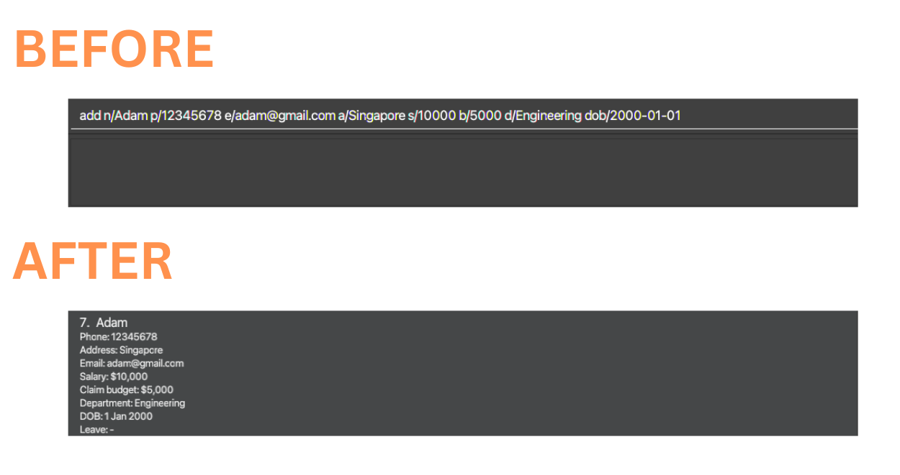

### Listing all employees : `list`

Lists all the details of an organization’s employees, or list all employees of a specified department.

Format: `list [d/DEPARTMENT]`

Examples:

- `list` Lists all employees in the employee list.
- `list d/Engineering` Lists all employees in the Engineering department.
- `list d/Sales` Lists all employees in the Sales department.

Executing command: `list d/Engineering`

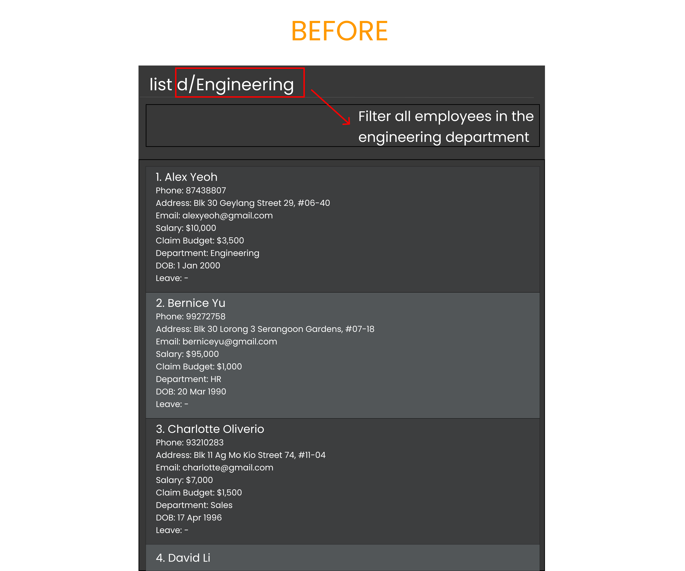

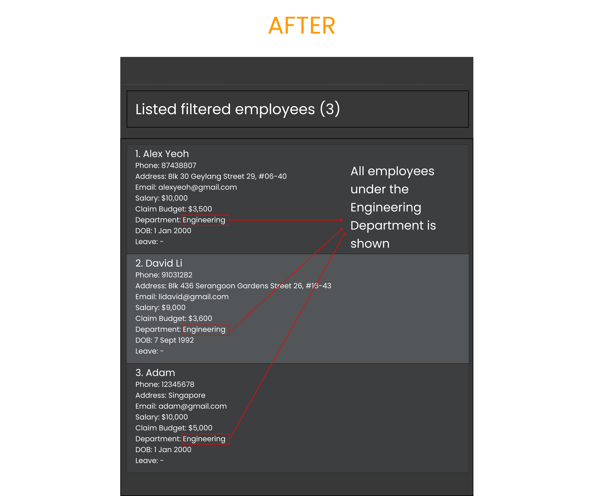

### Deleting an employee : `delete`

Delete an employee in the employee list by the specified index.

Format: `delete INDEX`

- Deletes the employee at the specified `INDEX`.
- The index refers to the index number shown in the displayed employee list.
- The index **must be a positive integer**: 1, 2, 3, …​

Examples:

- `list` followed by `delete 2` deletes the 2nd person in the employee list.
- `find Betsy` followed by `delete 1` deletes the 1st person in the results of the `find` command.
- `list d/Engineering` followed by `delete 1` deletes the 1st person in the employee list.

Executing command: `delete 1`

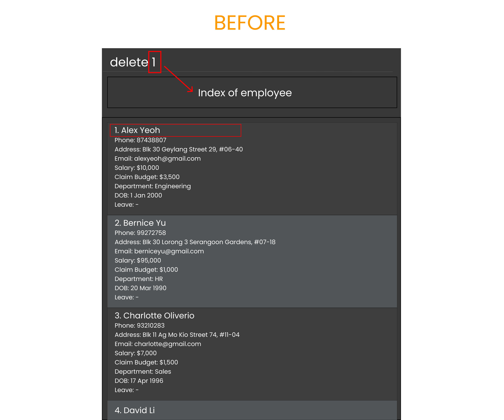

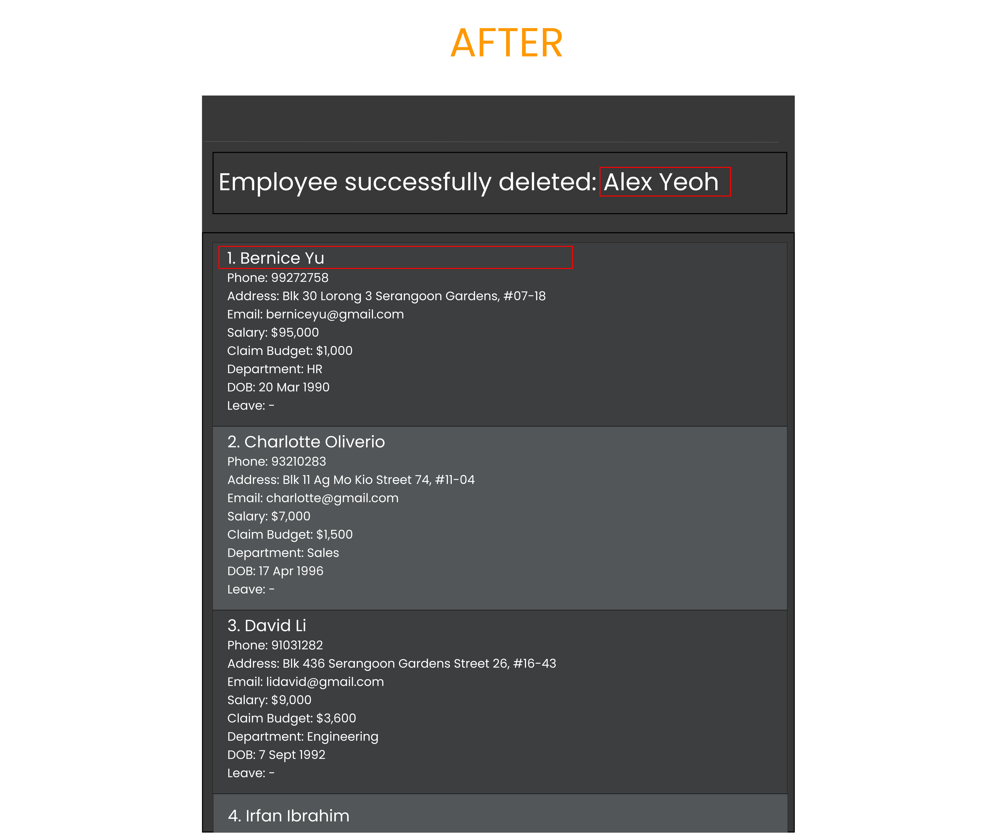

### Editing an employee's information : `edit`

Edits an existing employee in the employee list by the specified index.

Format: `edit INDEX [n/NAME] [p/PHONE] [e/EMAIL] [a/ADDRESS] [s/SALARY] [d/DEPARTMENT] [dob/BIRTH_DATE (YYYY-MM-DD)]`

- Edits the employee at the specified `INDEX`. The index refers to the index number shown in the displayed employee list.
  The index **must be a positive integer** 1, 2, 3, …​
- At least **one** of the optional fields must be provided.
- Existing values will be updated to the input values.
- Some prefixes allow for additional descriptors to accommodate a variety of input data that fits within the context of the field, provided they conform to the input requirements.
  - For `[n/NAME]`, specific descriptors (S/O, D/O, etc.) are allowed. Ensure that the full input between the prefix and the next space or prefix is intended as part of the name.

Examples:

- `edit 1 p/23423423 e/barry@example.com` Edits the phone number and email address of the 1st person to be `23423423` and `barry@example.com` respectively.
- `edit 1 n/thomas S/O anthony a/Serangoon` Edits the name and address of the 1st person to be `thomas S/O anthony` and `Serangoon` respectively.
- `edit 2 s/1000 d/Sales dob/2000-01-01` Edits the salary, department and DOB of the 2nd person to be `$1000`, `Sales` and `1 January 2000` respectively.

Executing command: `edit 1 p/23423423 e/barry@gmail.com`

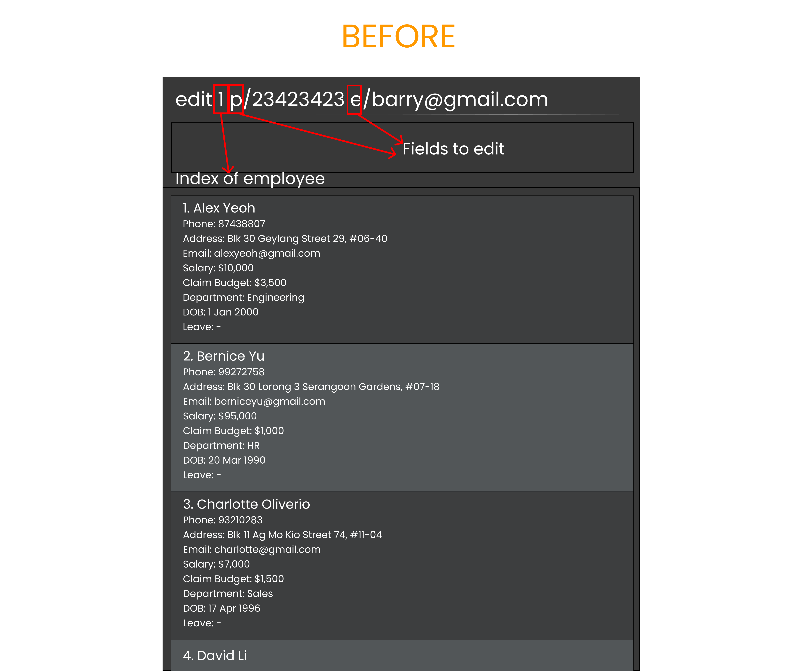

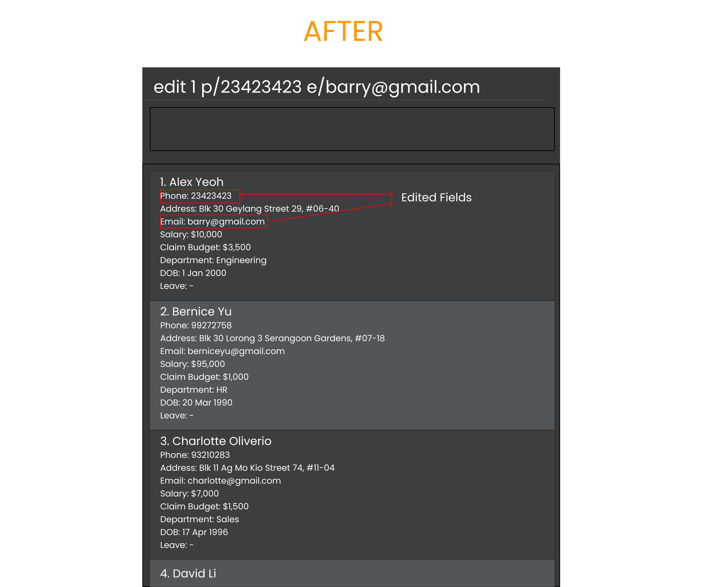

### Finding employees by name: `find`

Finds employees whose names match any of the given keywords.

Format: `find KEYWORD [MORE_KEYWORDS]`

- The search is case-insensitive, e.g `hans` will match `Hans`.
- The order of the keywords does not matter, e.g. `Hans Bo` will match `Bo Hans`.
- Only the name is searched.
- Only full words will be matched, e.g. `Han` will not match `Hans`.
- Persons matching at least one keyword will be returned (i.e., `OR` search).
  e.g. `Hans Bo` will return `Hans Gruber`, `Bo Yang`.

Examples:

- `find John` returns `john` and `John Doe`
- `find alex david` returns `Alex Yeoh`, `David Li` 
- `find Bernice` returns `bernice`.

Executing command: `find Bernice`

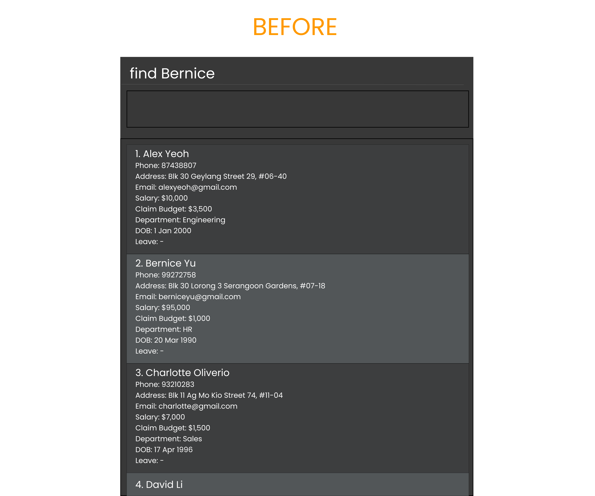

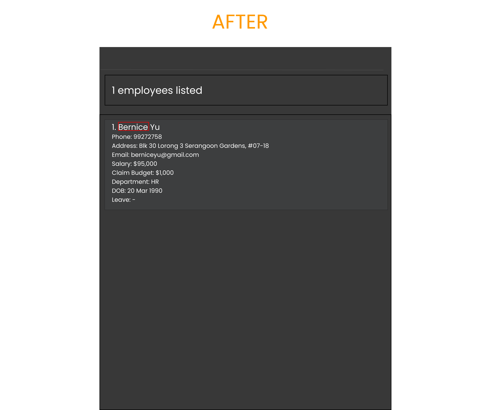

### Clearing all entries: `clear`

Clear all entries from the employee list.

Format: `clear`

Executing Command: `clear`

### Managing employee's claims: `claim`

Performs adjustments to employee's claims.

Format: `claim INDEX $/CLAIM_AMOUNT`

- The `INDEX` refers to the index number shown in the displayed employee list.
- The index **must be a positive integer** 1,2,3, ...
- The `CLAIM_AMOUNT` should consist of either + or - which symbolizes adding/deducting respectively followed by the **amount.**
  - If the `CLAIM_AMOUNT` is _positive_, it symbolizes **allocation of more** funds to the user's claim budget.
  - If the `CLAIM_AMOUNT` is _negative_, it symbolizes **deduction of funds** from the user's claim budget.

Examples:

- `list` followed by `claim 1 $/-500` deducts $50 from employee 1's claim budget.
- `list` followed by `claim 2 $/+60` allocates additional $60 to employee 2's claim budget.
- `list` followed by `claim 3 $-1000` deducts $1000 from employee 3's claim budget.

Executing command: `claim 1 $/-500`

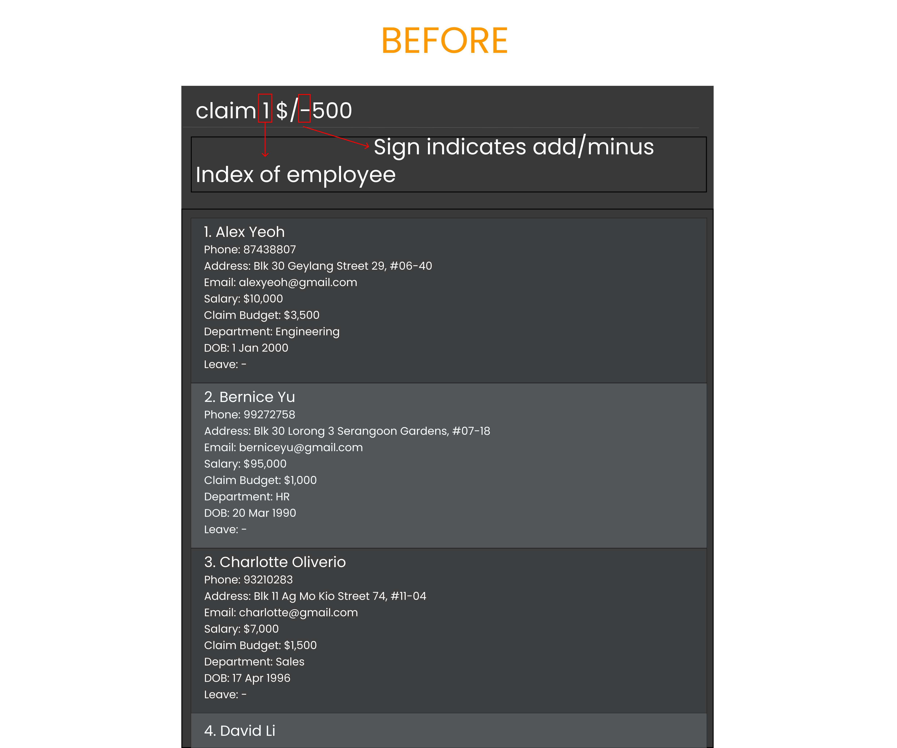

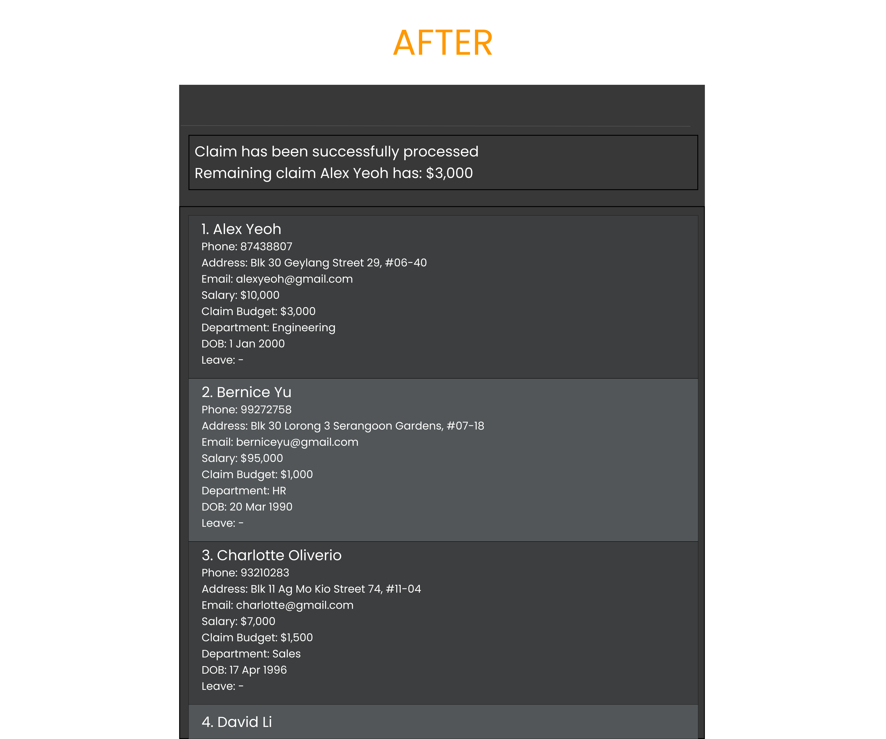

### Adding employee’s Leave: `leave`

Adds leave months for an employee.

Format:  `leave INDEX m/MONTHS`

- The `INDEX` refers to the index number shown in the displayed employee list.
- The `INDEX` **must be a positive integer** 1,2,3, ...
- The `MONTHS` refers to the month of the leave the employee is taking in integer format (between 1-12).
- Positive `MONTHS` add leaves on the specified months and negative `MONTHS` remove them.
- Trailing commas in `MONTHS` (`leave 1 m/1,2,3,,,`) will be ignored, but empty months elsewhere (`leave 1 m/1,,,2`) will raise an error.

Examples:
- `list` followed by `leave 1 m/3,4` adds leaves in March and April for the 1st employee in the list.
- `list` followed by `leave 3 m/11,-12` adds a leave in Nov and removes a leave in Dec for the 3rd employee in the list.
- `list` followed by `leave 2 m/3` adds a leave in March for the 2nd employee in the list.

Executing command: `leave 1 m/1,3`

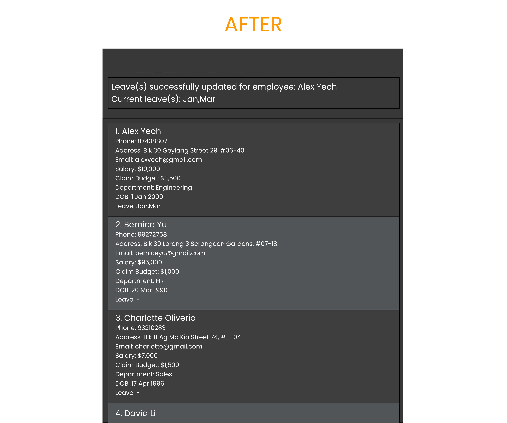

### Viewing all employees' leaves : `view_leave`

Views all employees who are on leave, with optional filters of month and department.

Format:  `view_leave [m/MONTHS] [d/DEPARTMENT]`

- Gives a list of **all employees** who have leaves planned for the year.
- The `MONTHS` and `DEPARTMENT` are optional arguments.
- Multiple `MONTHS` can be specified, in which employees who have planned leaves in any of the specified months will be shown ("either or" relationship).
- When specifying multiple `MONTHS`, the months should be separated with commas with no spaces.
- If no one in the specified department has planned leave dates for the given month(s), an output indicating **no employees is taking leave** is shown.
- Trailing commas in `MONTHS` (`view_leave m/1,2,3,,,`) will be ignored, but empty months elsewhere (`view_leave m/1,,,2`) will raise an error.

Examples:
- `view_leave` displays all employees who have planned leave dates in the current year.
- `view_leave m/10` displays all employees who are taking leave in October.
- `view_leave m/1,2` displays all employees who are taking leave in January or February.
- `view_leave m/10 d/IT` displays all employees in the IT department who are taking leave in October.

Executing command: `view_leave m/1,3`

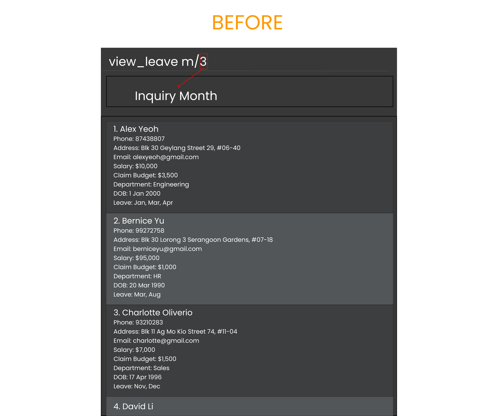

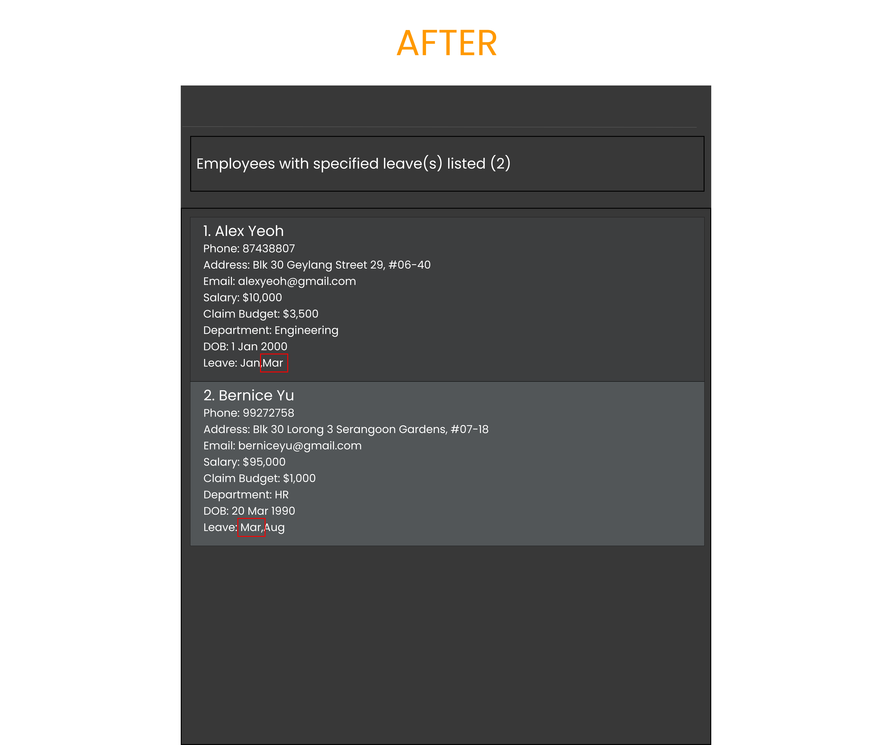

### Resetting all employees' leaves : `reset_leaves`

Reset all employees to have no recorded leaves.

Format: `reset_leaves`

Executing command: `reset_leaves`

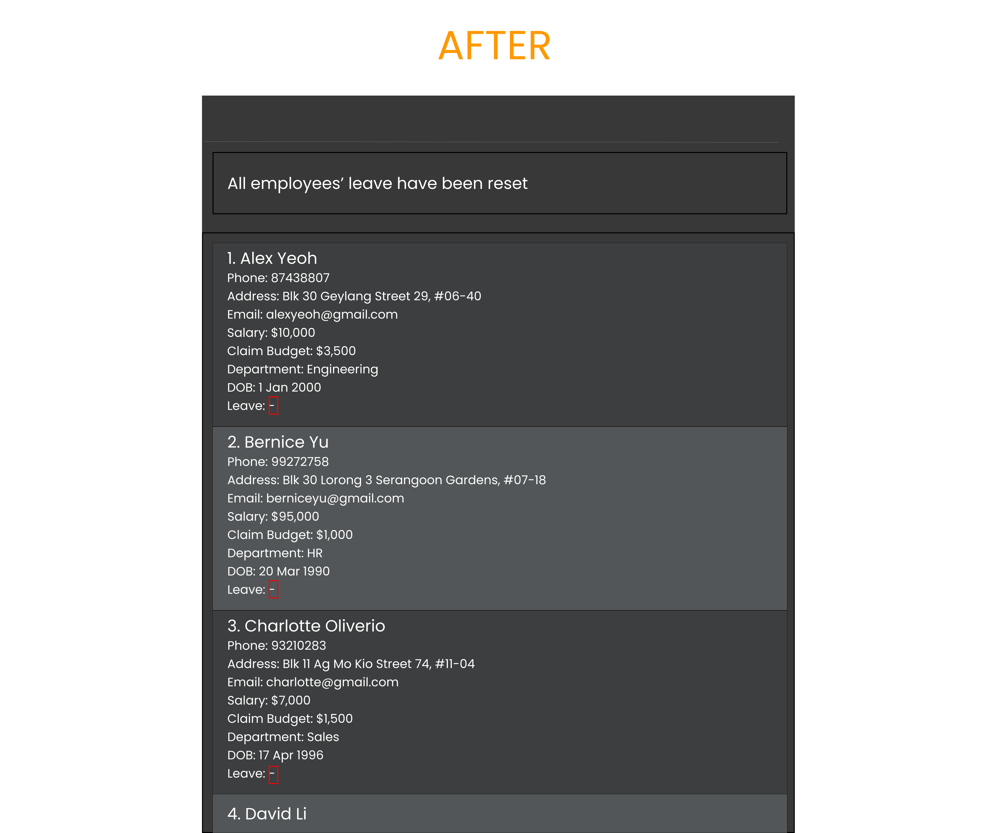

### Viewing all birthdays in a given month : `birthday`

Views all employees’ birthday in the given months.

Format:  `birthday [m/MONTH(s)]`

- Gives a list of **all employees** who have upcoming birthdays in the **inquired month(s)**.
- The month argument is optional. If **no month** is provided, the birthdays in the **current month** are listed.
- If there is no birthday in the month provided, return **No employees have birthdays in this month**.
- Months are separated using ",", e.g. to inquire the employees who have birthdays in Mar and Apr, the input is `birthday m/3,4`.
- Trailing commas in `MONTH(s)` (`birthday m/1,2,3,,,`) will be ignored, but empty months elsewhere (`birthday m/1,,,2`) will raise an error.

Examples:
- `birthday` displays all employees who have their birthday in the current month.
- `birthday m/10` displays all employees who have their birthday in the month of October.
- `birthday m/1,3,4` displays all employees who have their birthday in the month of Jan, Mar and Apr.

Executing command: `birthday m/1`

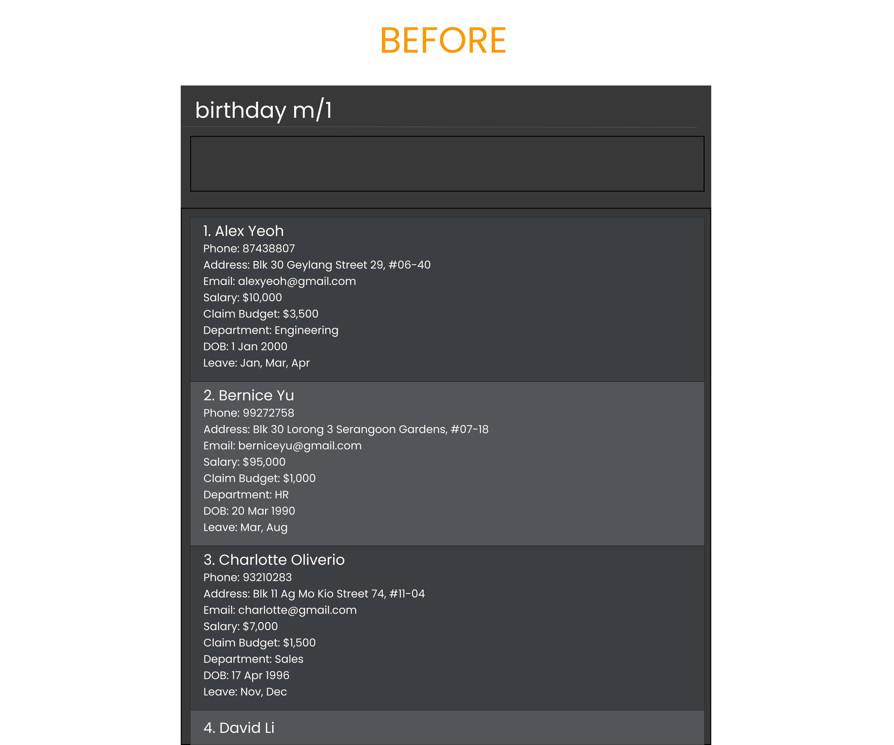

### Viewing employee's details: `view`

Views employee(s)'s personal attribute.

Format:  `view [n/INDEX] [a/INDEX] [e/INDEX] [p/INDEX] [s/INDEX] [b/INDEX] [d/INDEX] [dob/INDEX]`

- ViewCommand provides overview of employee(s)'s attributes.
- Maximum of one prefix is allowed. This means the user can only view one attribute at a time.
- INDEX refers to the index number shown in the displayed employee list.
- INDEX parameters can either be a single digit or digits separated by ",".

Examples:
- `view s/1,2` displays the 1st and 2nd employee respective salaries.
- `view a/3,4` displays the 3rd and 4th employee respective addresses.
- `view dob/1,5` displays the 1st and 5th employee respective DOB.

Executing command: `view p/1,5`

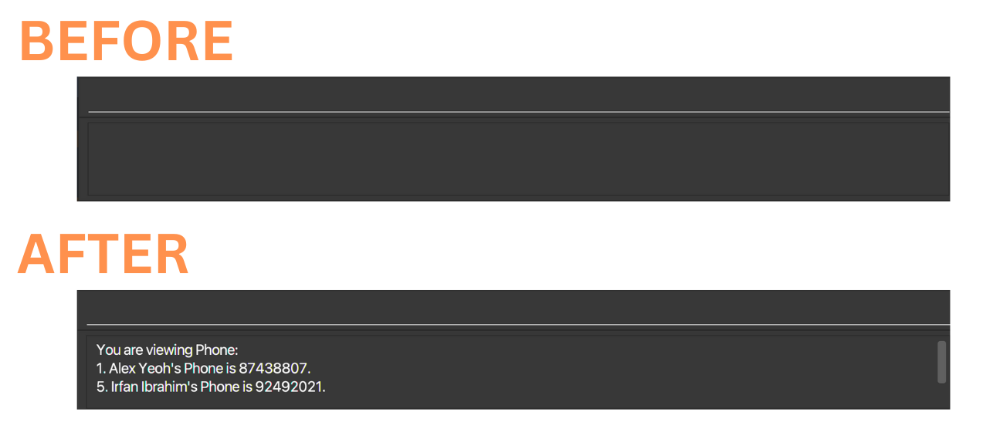

### Sorting the employee list: `sort`

Sorts the employee list based on the given parameter.

Format: `sort name / phone / email / address / salary / claim / dep / dob [desc]`

- Choose one parameter from `name / phone / email / address / salary / claim / dep / dob` to sort.
- Put `desc` to sort in descending order.

Examples:
- `sort name` to sort the employee list based on name in ascending order.
- `sort salary desc` to sort the employee list based on salary in descending order.
- `sort claim` to sort the employee list based on claim budget in ascending order.

Executing command: `sort name desc`

 
### Undoing previous commands: `undo`

Undo the most recent commands that modified the employee list, i.e., `add`, `edit`, `delete`, `leave`, `reset_leaves`, `clear`, `sort`, `redo` commands.

Format: `undo`

Executing command: `undo`

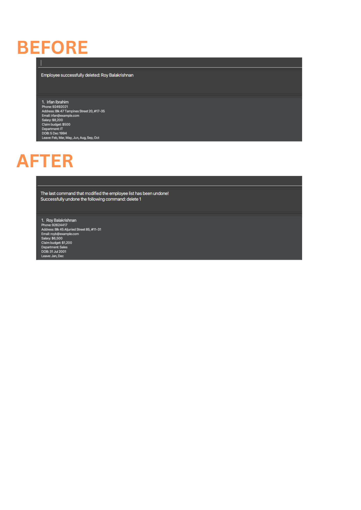

### Redoing previous undone commands: `redo`

Redo the most recent commands that was undone.

Format: `redo`

You cannot redo your most recent undone command if, after your last `undo`, you execute another command(s) that modifies the employee list.

Executing command: `redo`

### Exporting employee's details: `export`

Export employee's details into a csv file format.

Format:  `export [file_name]`

- ExportCommand provides HR employees a way to download employees' data into CSV format.
- The exported file_name.csv will be found in the Exported_CSVs folder.
- You must provide a file_name. File_name can comprise alphanumeric and special characters.
- To export only a subset of employees, user should perform filtering before exporting.

Examples:
- `list` followed by `export all_data` will download all employees' attributes into a csv file.
- `list d/Engineering` then `export engineering_team` will only download employees in engineering department.
- `birthday m/1` then `export birthday_Jan` will only download employees with birthdays in January.

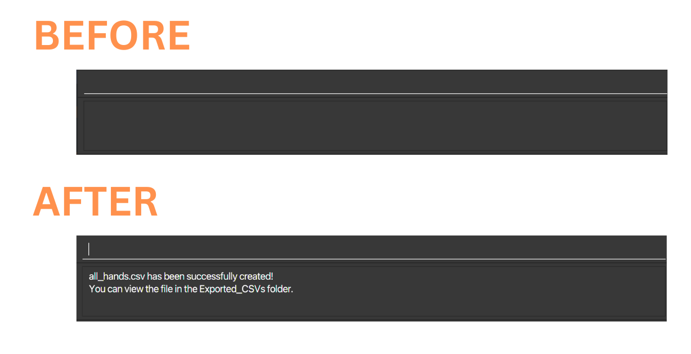

### Changing the Application Theme : `theme`

Changes the theme of the application according to the current available options.

Format: `theme THEME_NAME`

Current available themes:
`dark`, `light`, `red`, `green`, `blue`.

Examples:
- `theme red` Changes the application theme to the red theme.
- `theme light` Changes the application theme to light theme.
- `theme green` Changes the application theme to green theme.

Executing command: `theme light`

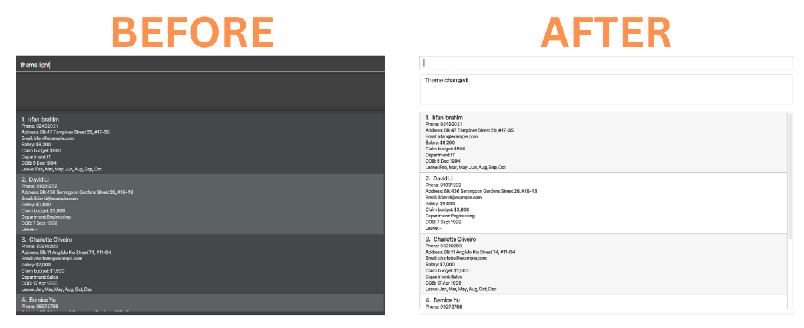

### Exiting the app: `exit`

Exits the app.

Format: `exit`

### Saving the data

HR Insight data are saved in the hard disk automatically after any command that changes the data. There is no need to save manually.

### Editing the data file

HR Insight data are saved automatically as a JSON file `[JAR file location]/data/hrinsight.json`. Advanced users are welcome to update data directly by editing that data file.

<box type="warning" seamless>

**Caution:**
If your changes to the data file make its format invalid, HR Insight will discard all data and start with an empty data file at the next run. Hence, it is recommended to take a backup of the file before editing it.
</box>

### More detailed leave records [Coming soon]

Currently, HR Insight only records employees' leave months. In v2.0, we will record the exact dates of employees' leaves to provide more detailed leave records.

---

## FAQ

**Q**: How do I transfer my data to another computer? 
**A**: Install the app on the other computer and overwrite the empty data file it creates with the file that contains the data of your previous HR Insight home folder.

---

## Known issues

1. **When using multiple screens**, if you move the application to a secondary screen and later switch to using only the primary screen, the GUI will open off-screen. The remedy is to delete the `preferences.json` file created by the application before running the application again.

---

## Command summary

| Action              | Format, Examples                                                                                                                                                                                                        |
|---------------------|-------------------------------------------------------------------------------------------------------------------------------------------------------------------------------------------------------------------------|
| **Help**            | `help`                                                                                                                                                                                                                  |
| **Add**             | `add n/NAME p/PHONE_NUMBER e/EMAIL a/ADDRESS s/SALARY b/CLAIM_BUDGET d/DEPARTMENT dob/BIRTH_DATE (YYYY-MM-DD)​`   e.g., `add n/John Doe p/87654321 e/john.doe@gmail.com a/Tokyo s/5000 b/2000 d/Sales dob/1992-07-21` |
| **List**            | `list [d/DEPARTMENT]`                                                                                                                                                                                                   |
| **Delete**          | `delete INDEX`  e.g., `delete 3`                                                                                                                                                                                     |
| **Edit**            | `edit INDEX [n/NAME] [p/PHONE] [e/EMAIL] [a/ADDRESS] [s/SALARY] [d/DEPARTMENT] [dob/BIRTH_DATE (YYYY-MM-DD)]`   e.g., `edit 1 p/23423423 e/barry@example.com`                                        |
| **Find**            | `find KEYWORD [MORE_KEYWORDS]`  e.g., `find James Jake`                                                                                                                                                              |
| **Clear**           | `clear`                                                                                                                                                                                                                 |
| **Claim**           | `claim INDEX $/CLAIM_AMOUNT`   e.g., `claim 1 $/-500`                                                                                                                                                                |
| **Add Leave**       | `leave INDEX m/MONTHS`   e.g., `leave 1 m/3,-4`                                                                                                                                                                      |
| **View Leave**      | `view_leave INDEX m/Month d/DEPARTMENT`   e.g.,`view_leave m/10 d/IT`                                                                                                                                                |
| **Reset Leaves** | `reset_leaves` |
| **View Birthdays**  | `birthday [m/MONTH]`   e.g., `birthday 10`                                                                                                                                                                           |
| **View Attributes** | `view [n/INDEX] [a/INDEX] [e/INDEX] [p/INDEX] [s/INDEX] [b/INDEX] [d/INDEX] [dob/INDEX]`   e.g., `view s/1,2`                                                                                                        |
| **Sort**           | `sort name / phone / email / address / salary / claim / dep / dob [desc]`                                                                                        |
| **Undo**           | `undo`                                                                                                                                                           |
| **Redo**           | `redo`                                                                                                                                                              |
| **Export Data**     | `export [file_name]`   e.g., `export engineering_dept`                                                                                                                                                               |
| **Change Theme**    | `theme THEME_NAME`   e.g., `theme light`                                                                                                                          |
| **Exit**            | `exit`                                                                                                                                                                                                                  |
